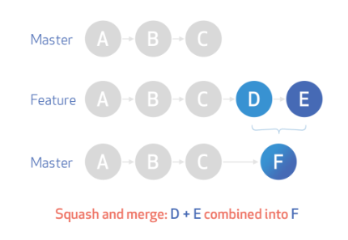
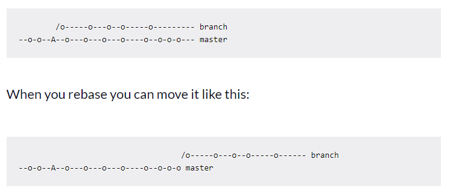

# Assignment - 08 March Git research assignment
## Squash and merge
- keeps git history tidy and easier to digets than what is created by merge commits
- squashing retains the changes but omits the individual commits from history 
- lots prefer because work-in-progress commits aren't important to retain whne looking at the history of your base branch
- 

## Rebase and merge
- rebasing is a way to move the entirety of a branch to another point in the tree
- temporarily "undo" the changes in the current branch, apply changes from the base branch, and then reapply the undone changes
- 
- `git rebase master` | where master is the branch you want to rebase on

## What are forks?
- forking is a concept of making a copy of the main repository to your account so that modifications can be made in it
- it is possile to submit a pull request to the main repository with the modifications
- it makes sure that the main repository is prevented from unwanted changes
- any public Git repository can be forked or cloned
- in contrast to a fork, a Git clone creates a linked copy that will continue to synchronize with the target repository

## git rebase -i | master command
- git rebase interactive
- allows to modify, reorder, or combine commits in a branch's history
- it provides a way to interactively choose which commits to pick, edit, squash, or drop during the rebase process
- git rebase -i ~HEAD3 -> this it will start three behind the head commit. Can also type the commit hash
- an interactive rebase editor will open, displaying a list of commits in chosen range
- can modify this list to control the rebase. Common actions include:
    1. pick (p): Keeps the commit as is.
    2. edit (e): Pauses the rebase to allow you to amend the commit
    3. squash (s): Combines the commit with the previous one.
    4. fixup (f): Similar to squash, but discards the commit message
    5. reword (r): Allows you to edit the commit message
    6. drop (d): Removes the commit
- `git rebase --continue` -> continues the rebase 
- `git rebase --abort` -> stops the rebase and returns branch to original stage

