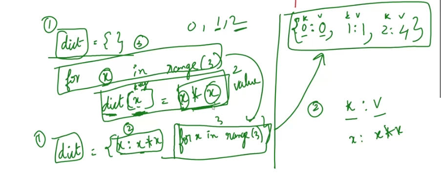

## General
- for comments in in git, should be why you added it not what
- more descriptive the better
- more comments at different times the better

- What is the difference bewteen parameters and arguments

- All sequences are iterables
- using map: always input and output will be the same, gives you a copy and transforming data type
- using filter: output is shorter or equal to input, gives a copy and same data type 

- https://whimsical.com/python-data-types-classification-Q967VqqPXDmUW5QPjXgdK2

## Monday assignments
- currying and partials ***
- parameters vs arguments ***
- task 4 for day 5 seq ex | done
- nested exercise
- event ex 

## Python docs
- https://docs.python.org/3/library/datetime.html

## Variable names cannot be 
- keywords
- starting with a number
- they are case sensetive | city, CITY are different 
- including special characters except _

## List comprehension

## Dictionary comprehension

## Regex
- https://regexone.com
- https://regex101.com
- [] character set
- {} repetition

- assignment - look behind in regex

## 5 pillars -> good quality
- 1: readability -> for loop to list comprehension makes it more readable
- 2: maintainability -> reuseable
- 3: extendability
- 4: testability
- 5: performance

## is vs ==
- is points to memory address | checks none -> singleton
- == checks value

## assignment for tomorrow (29 Feb)

1. @property,  @balance.setter
2. Creating you own decorator 
    - Using function
    - Using classes

## fibonacci shortening 

## Emmet cheat sheet
- https://docs.emmet.io/cheat-sheet/ 